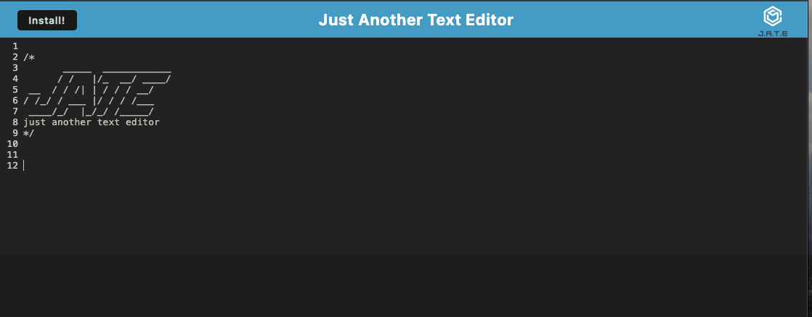

# PWA Text Editor

## Description

The purpose of this project was to build a text editor that runs in the browser. The application features a number of data persistence techniques that serve as redundancy in case one of the options is not supported by the browser. The app also functions offline.

## Installation

The project repository can be found at the following GitHub Page: https://github.com/j-preim/note-taker

The deployed application can be found deployed on Heroku here: 

## Usage

The website will appear as it does in the following screenshot:

## Credits

Starter code was used from the provided repository, as well as additional code provided by our instructor to complete this project.

## License

Copyright (c) 2023 Joe Preimesberger

Licensed under the MIT license.